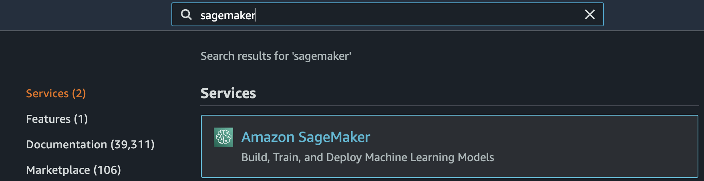

# Builder Workshop 1 - Prompt Engineering Lab

## Introduction 

### Foundation Models (Large Language Models)
Foundation models are a class of generative AI models that are capable of understanding and generating human-like language at a massive scale. These LLMs are trained on vast amounts of text data, often on the order of billions of words or more, using techniques such as unsupervised learning and self-supervised learning. They are capable of generating high-quality human-like language across a wide range of tasks, including language translation, text summarization, and creative writing.

One of the key advantages of foundation models is that they can be fine-tuned on smaller datasets for specific tasks, making them highly adaptable to a wide range of applications. For example, a foundation model that has been pre-trained on a large dataset of news articles and books can be fine-tuned on a smaller dataset of medical texts to generate summaries of medical research papers. Foundation models have the potential to revolutionize the field of natural language processing (NLP) by enabling new forms of language-based applications and services. As these models continue to evolve and improve, we can expect to see even more exciting and transformative applications emerge in the future.

### SageMaker JumpStart
*Amazon SageMaker JumpStart* is a powerful feature within the Amazon SageMaker machine learning platform that provides developers with a comprehensive hub of state-of-the-art (SOTA) language, vision, and other modalities' deep learning models. With over 600 pre-trained models available and growing every day, SageMaker JumpStart enables developers to quickly and easily incorporate cutting-edge machine learning techniques into their production workflows.

One of the key benefits of SageMaker JumpStart is that it provides developers with access to hundreds of built-in algorithms and pre-trained models from leading model hubs and providers tailored in all the most popular machine learning frameworks like PyTorch, HuggingFace, TensorFlow and more. It also comes with a low-code user interface that makes it easy to get started with deep learning, even for those without extensive machine learning expertise. In addition, JumpStart also provides solution templates for common use cases, as well as executable example notebooks that demonstrate best practices for machine learning with SageMaker.

### SageMaker JumpStart Foundation Model Hub
*Amazon SageMaker Foundation Model Hub* is a NEW feature of SageMaker JumpStart which is a model hub or zoo for SOTA deep learning models that are tailored for a wide range of advanced text and image generation use cases. This hub includes both public and proprietary models, such as those from AWS partners like Stability AI, Cohere, AI21, as well home brewed models like Amazon's own AlexTM and many coming soon.

These LLMs excel in standard benchmarks and are capable of solving a wide range of problems such as text-to-image generation, text summarization, abstractive question answering, sentiment analysis, and entity extraction, among others. They come with a user-friendly playground that allows developers to interactively test different flavors of the models and generate outputs with different generation configurations.

You can access these models via APIs or through SageMaker Studio, and fine-tune or deploy them for your domain-specific use cases with just a few clicks in a no-code fashion, or via APIs if you prefer a high-code execution style. These models come with all the benefits of SageMaker training and hosting and allow you to create endpoints that are automatically enabled for resiliency, scalability, load balancing, and fault tolerance. They tightly integrate with all SageMaker components and AWS services for seamless integration into your existing workflows.

As the number of models continues to grow, SageMaker Foundation Model Hub will remain an essential resource for those seeking to stay at the forefront of the field of generative AI and deep learning.

This lab contains exercises for SageMaker Jumpstart Generative AI, a tutorial series designed to help users get started with generative AI using SageMaker.

## Accessing the Lab 

First, navigate to this [link](https://catalog.us-east-1.prod.workshops.aws/join?access-code=f5e7-092973-c6). You should see a page like this: 


Click "Email one-time password (OTP)" 


Enter your email address and click send passcode. 


Enter the OTP sent to your email and click sign-in. Accept the Terms and click Join Event. 


Once you have joined the event, navigate to the sidebar and click "Open AWS Console (us-east-1)"


You should be brought to the AWS Console. 

## Amazon SageMaker Studio access 

Amazon SageMaker Studio is a web-based, integrated development environment (IDE) for machine learning that lets you build, train, debug, deploy, and monitor your machine learning models. Studio provides all the tools you need to take your models from experimentation to production while boosting your productivity.

Follow the next steps to access the SageMaker Studio environment:

1. Open AWS console and switch to AWS region us-east-1.

    


2. Under services search for **Amazon SageMaker**.

    

3. Click **Domains** on the sidebar. 

    

4. Click on **StudioDomain** under Domains. 

    

5. A SageMaker Studio environment should already be provisioned. Click on Launch (on the right side of the preprovisioned *studio-user* username).

    

6. Click **Studio** to launch JupyterLab Studio. 

    

7. The page can take 1 or 2 minutes to load when you access SageMaker Studio for the first time.

    

8. You will be redirected to a new web tab that looks like this:

    

9. Once inside SageMaker Studio, you'll see a toolbar on the left-hand side of the screen. Click on the "Launcher" icon as shown below.

    

10. We will need to now opean a terminal window. To open the terminal window, click on the System terminal tile located on the launcher, as demonstrated below.

    

11. Copy the following command line interface (CLI) commands (shared below) and paste them into the System terminal that has been opened. This will clone the repository containing all necessary data and notebooks for this lab, as demonstrated below.

    ```shell 
    git clone https://github.com/aws-samples/amazon-sagemaker-generativeai.git
    ```

    

12. After the repository is successfully cloned, you should be able to view the files under the file directory, as illustrated below.

    


**Congratulations!!** You have successfully launched a SageMaker Studio Notebook and setup the repository required for the next section.

## Prompt Engineering Lab

### Setup UI utility for prompt engineering 

1. Click on Home on the left panel

    

2. Click on SageMaker JumpStart and navigate to Models,notebooks,solutions link within SageMaker Jumpstart in the drop-down menu.

    

3. In the search bar on the right, sarch for `Flan-T5 XL` model and click on `Flan-T5 XL`.

    

4. This should bring you to a window that looks like this. Click on the Deployment Configuration Expander.

    

5. You can leave all these settings as default. Make sure to take note of the **Endpoint name** . Press the **Deploy** button in blue. 

    

6. You should see a page like this while the endpoint is being created. This can take 5-10 minutes. 

    

7. Once the endpoint has been created, the page will change to this page. Copy and paste the endpoint name. 
    

8. Now that our endpoint is created (which can also be seen in SageMaker-Studio dashboard), navigate to studio-playground-ui folder within amazon-sagemaker-generativeai. Within the folder, you will see main.py file and a templates folder. Inside templates folder open FLANT5-XXL-JS.template.json file with editor option (right click on file, click **Open With**, and select **Editor** ). 
    

    

9. Replace the `model_name` attribute with `FlanT5xl-model`. 'Replace the `endpoint_name` with your endpoint name created in the previous steps and save the file.

    
    

10. Click on `File` within SageMaker Studio tab, click on `New` and navigate to `Terminal` run the following command: 

    ```shell 
    pip install boto3 streamlit streamlit-ace -Uq
    ```
    Note: Please ignore any warnings or errors related to pip's dependency...


11. Change into the correct directory by running this command in the same teriminal: 

    ```shell 
    cd amazon-sagemaker-generativeai/studio-playground-ui/
    ```
12. Run this command to open the Streamlit UI: 
    ```shell
    streamlit run main.py
    ```
13. You should see something like this. Copy/remember the four digit port number as seen below. It will probably be `8501`. 

    

14. Copy the URL of the SageMaker Studio page that you are on: 

    

15. Modify the URL you just copied as below. The link you have will probably look something along this lines: 

    ```shell
    https://d-ukwe6ogova0k.studio.us-east-1.sagemaker.aws/jupyter/default/lab/workspaces/auto-c/tree/amazon-sagemaker-generativeai/studio-playground-ui/templates
    ```

    Here, `d-ukwe6ogova0k` is `<your-unique-sagemaker-id>`. Paste that into the URL below in the appropriate place. Change the port number to the port number you recorded before (it should probably be `8501` ). Make sure to include the trailing `/` after the port number or else it won't work! 

    ```shell
    https://<your-unique-sagemaker-id>.studio.us-east-1.sagemaker.aws/jupyter/default/proxy/<port-no>/
    ```

16. Navigate to that new link. You should see a page similar to this: 

    

17. Select the `FlanT5-XXL-JS` model on the dropdown on the side.

    

18. Once you select the model you will see a variety of parameters to adjust in the next part of the lab. You will enter your text prompts in the box on the right and press run to call the model. 

    


Now we can get started with the model playground and run prompt engineering on the deployed model endpoint within our environment in a secured fashion! 


## Zero Shot Prompt Engineering 

### Zero Shot Prompting
Zero-shot prompting enables a model to make predictions about previously unseen data without the need for any additional training.

Zero-shot learning in NLP allows a pre-trained LLM to generate responses to tasks that it hasn’t been specifically trained for. In this technique, the model is provided with an input text and a prompt that describes the expected output from the model in natural language. The pre-trained models can use its knowledge to generate coherent and relevant responses even for prompts it hasn’t specifically been trained on.

In the context of prompt engineering, zero-shot learning can be used to generate natural language text without the need for explicit programming or pre-defined templates.

Zero-shot learning can reduce the time and data required while improving efficiency and accuracy of NLP tasks. Zero-shot learning is used in a variety of NLP tasks, such as question answering, summarization, and text generation.

### [Zero-shot prompting with FLAN-T5 XL Model](https://catalog.us-east-1.prod.workshops.aws/event/dashboard/en-US/workshop/lab2/zero-shot#zero-shot-prompting-with-flan-t5-xl-model)
A popular encoder-decoder model known as T5 (Text-to-Text Transfer Transformer) is one such model that was subsequently fine-tuned via the Flan method to produce the Flan-T5 family of models. Flan-T5 is an instruction-tuned model and therefore is capable of performing various zero-shot NLP tasks, as well as few-shot in-context learning tasks. With appropriate prompting, it can perform zero-shot NLP tasks such as text summarization, common sense reasoning, natural language inference, question answering, sentence and sentiment classification, translation, and pronoun resolution. The examples provided in this post are generated with the Flan-T5 family.

JumpStart provides convenient deployment of this model family through Amazon SageMaker Studio and the SageMaker SDK. This includes Flan-T5 Small, Flan-T5 Base, Flan-T5 Large, Flan-T5 XL, and Flan-T5 XXL. Furthermore, JumpStart provides three versions of Flan-T5 XXL at different levels of quantization:

Flan-T5 XXL – The full model, loaded in single-precision floating-point format (FP32).
Flan-T5 XXL FP16 – A half-precision floating-point format (FP16) version of the full model. This implementation consumes less GPU memory and performs faster inference than the FP32 version.
Flan-T5 XXL BNB INT8 – An 8-bit quantized version of the full model, loaded onto the GPU context using the accelerate and bitsandbytes libraries. This implementation provides accessibility to this LLM on instances with less compute, such as a single-GPU ml.g5.xlarge instance.
Since we have deployed a model endpoint in the lab setup, let us try to invoke the model in streamlit app on the deployed Flan-T5 XXL model.

Here are a few examples of what you can run with your deployed model with zero-shot prompting:

### Zero-Shot Prompting Use Cases 

**1. Text Summarization**

You can enter as input prompt to the text box within the application:

```text 
Input prompt: summarize the text below:

text = "Amazon Comprehend uses natural language processing (NLP) to extract insights about the content of documents. It develops insights by recognizing the entities, key phrases, language, sentiments, and other common elements in a document. Use Amazon Comprehend to create new products based on understanding the structure of documents. For example, using Amazon Comprehend you can search social networking feeds for mentions of products or scan an entire document repository for key phrases."

```

A sample output as shown below can be generated for generating a summary of the above text.

```text
['Amazon Comprehend is a natural language processing tool that helps you understand the structure of documents.']
```

Feel free to modify the model parameters to generate variations of the text above.

**2. Question-Answering Prompts** 

You can also prompt the model endpoint with Q-A based queries to generate a relevant output response.

```text
[user] Who are some of the best writers of English literature?
[bot] William Shakespeare, Charles Dickens, Oscar Wilde, Jane Austen, and William Blake
[user] Can you tell me more about Wilde?
[bot] He was a poet, painter, and engraver.
[user] Where was he born, and when?
[bot] Blake was born in London in 1757.
[user] What is the most famous book by him? what is the rationale behind it?
[bot]
```

Try inputting the above text in the prompt UI, play with the model parameters and inspect your respective output.

**3. Miscelleneous examples**

As another example, here is a sample prompt and the output the model generated:

```text
Sample Prompt: 
Can Geoffrey Hinton have a conversation with George Washington? 
Give the rationale before answering?
```

```text
Model output:
['Geoffrey Hinton is a British author. George Washington was an American politician. So the final answer is no.']
```

Similarly, you can use your creativity to test zero-shot prompting with different examples like the one below and compare the results with one-shot, few-shot and CoT prompting techniques as explained in the next lab.

References:

* https://aws.amazon.com/blogs/machine-learning/zero-shot-prompting-for-the-flan-t5-foundation-model-in-amazon-sagemaker-jumpstart/ 


## One-shot and Few-shot Prompt Engineering


### **One Shot Prompting**:

One-shot prompting is used to generate natural language text with a limited amount of input data such as a single example or template.

One-shot prompting can be combined with other natural language processing techniques like dialogue management and context modeling to create more sophisticated and effective text generation systems.

### One-shot Prompting Examples

Here, we will give one example to ensure the model generates the output structure that we would like to get back. The model will guess what we want in return based on the provided example and its training about the text:

**Example 1:**

```text
Indicate the topic from the Message below:

Message: When the spaceship landed on Mars, the whole humanity was excited
Topic: space

Message: I am trying to cook food with some ingredients I just bought.
Topic:
```


**Example 2:**

```text
Generation: Task is to generate airport codes
Text: "I want to fly from Los Angeles to Miami" Airport codes: LAX, MIA
Text: "I want to fly from Dallas to San Francisco" Airport codes: 
```


### **Few Shot Prompting**

Few-shot prompting is a technique where the model is given a small number of examples, typically between two and five, in order to quickly adapt to new examples of previously seen objects.

Few-shot learning can be used in the context of prompt engineering, to create natural language text with a limited amount of input data. Although it requires less data, this technique can allow for the creation of more versatile and adaptive text generation models.

By using advanced techniques such as few-shot prompting, it is possible to create natural language generation models that are more flexible, adaptable, and engaging for human users.

Here is an example to use few shot prompting with `Text Classification` use case:

```text
Classify the below use-case description to one of the following NLP tasks: Short form generation, Long form generation, Summarization, Classification, Question answering, Paraphrasing, Conversational agent, Information extraction, Generate code

Use case: My native language is not English, I have blogs and I write my own articles. I also get articles from outsource writers, so I want to use it to re-write such articles, so i will create a tool for that
NLP Task: Paraphrasing
##

Classify the below use-case description to one of the following NLP tasks: Short form generation, Long form generation, Summarization, Classification, Question answering, Paraphrasing, Conversational agent, Information extraction, Generate code

Use case: Just experimenting with content generation
NLP task: Long form generation
##

Classify the below use-case description to one of the following NLP tasks: Short form generation, Long form generation, Summarization, Classification, Question answering, Paraphrasing, Conversational agent, Information extraction, Generate code

Use case: My company MetaDialog provides human in the loop automated support for costumers, we are currently using GPT3 to generate answers using our custom search engine to clients questions, and then provide the answers as suggestions to human agents to use or reject them as real answers to clients.
NLP task: Conversational agent
##

Classify the below use-case description to one of the following NLP tasks: Short form generation, Long form generation, Summarization, Classification, Question answering, Paraphrasing, Conversational agent, Information extraction, Generate code

Use case: Receipt extraction including line items from plain text (sources being OCR-ed images, PDFs and HTML Emails)
NLP task: Information extraction
##

Classify the below use-case description to one of the following NLP tasks: Short form generation, Long form generation, Summarization, Classification, Question answering, Paraphrasing, Conversational agent, Information extraction, Generate code

Use case: I have a lot of legacy documentation which needs to be cleaned, summarized, and queried. I think AI21 would help.
NLP task: Summarization

##

Classify the below use-case description to one of the following NLP tasks: Short form generation, Long form generation, Summarization, Classification, Question answering, Paraphrasing, Conversational agent, Information extraction, Generate code

Use case: Answer questions based on a given corpus of information
NLP task:
```

```text
Model Output: 
['Question answering']
```

Run the above examples to see the output and validate the response on your end.

## Chain of Thought Prompt Engineering 

### **Chain of Thought Prompting** 

Chain-of-thought (CoT) prompting improves the reasoning ability of LLMs by prompting them to generate a series of intermediate steps that lead to the final answer of a multi-step problem.

Now, lets run through some examples.

### Question Answer Prompting

Chain of Thought (CoT) prompting is a recently developed prompting method, which encourages the LLM to explain its reasoning.

Here, we will give an example to ensure the model generates the output structure that we would like to get back with some reasoning. The model will guess what we want in return based on the provided example and its training about the text:

```text
Question: Roger has 5 tennis balls. He buys 2 more ans of tennis balls. Each can has 3 tennis balls. How many tennis balls does he have now.

Answer: Roger started with 5 balls. 2 cans of 3 tennis balls each is 6 tennis balls. 5 + 6 = 11. The answer is 11. 

Question: John takes care of 3 dogs. Each dog takes 2 hours a day to walk and take care of their business. How many hours a week does he spend taking care of dogs? 
Answer: 
```

Once we have provided a sample response to one of our questions, the model should be able to provide a similar explanation to the previously provided example.

```text
Model Output: ['He spends 2 * 3 = 6 hours a day taking care of the dogs. So he spends 6 * 7 = 42 hours a week taking care of the dogs. The answer is 42.']
```

Run the below example and inspect the model response for your deployed model endpoint.

```text
Q: A coin is heads up. Maybelle flips the coin. Shalonda does not flip the coin. Is the coin still heads up?
A: The coin was flipped by Maybelle. So the coin was flipped 1 time, which is an odd number. The coin started heads up, so after an odd number of flips, it will be tails up. So the answer is no.

QUESTION: A coin is heads up. John does not flip the coin. Shalonda does not flip the coin. Is the coin still heads up?
ANSWER:
```

## Congrats! You've completed this part of the Builder's Workshop! 
